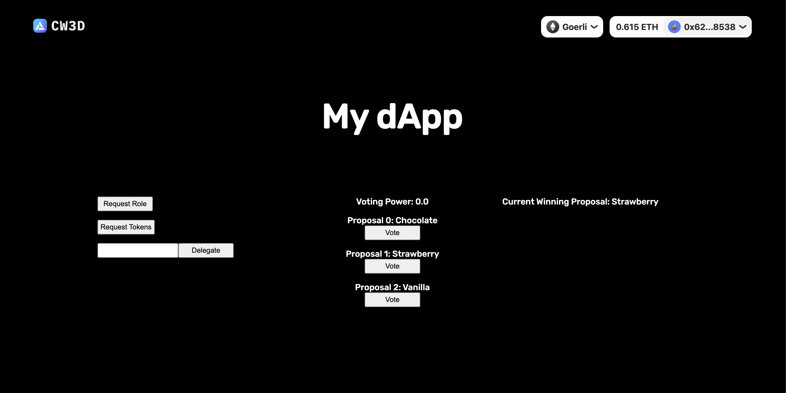

# encode_weekend4

backend: https://github.com/ilam0602/encode_weekend4_backend

frontend: https://github.com/ilam0602/encode_weekend4_frontend

contracts: https://github.com/ilam0602/encode_weekend4_contracts

Created a voting dApp using nest on the backend and create-web3-app on the front end

We implemented functions as followed: 

1. Implemented button to receive minter role by connecting to the contract on chain

2. Implemented button to request voting tokens by connecting to the contract on chain

3. Implemented button to delegate voter by connecting to the contract on chain

4. After delegation the transaction hash of the delegation is displayed and linked

5. Created a component to check voting power of connected wallet by querying the contract on chain

6. Implemented buttons to vote for the 3 different proposals that connects to the contact on chain and carries out the vote function for each

7. Retrieved winning proposal from contract and displayed winning proposal name by querying the contract on chain

